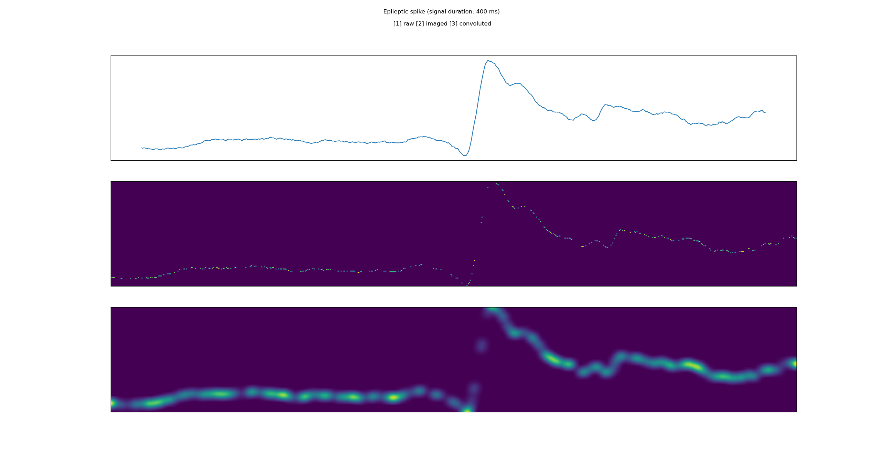

# Description
This program presents convolutional kernel density estimation, a method used to detect intercritical epilpetic spikes (IEDs) in [Gardy et al., 2019].

The user provides a time series as input. The algorithm will perform the following steps:
- Transform the timeseries into an image
- Convolve this image

The user can then apply filters, like a low-pass filter, to isolate low density events, such as IEDs.

Please, open _**`main.py`**_ and change the path inside to use the program.

# Procedure example (main.py)
```
### User should change these information in the script (main.py).

root = r"~/CKDE"
event_num = 5
```

# Some information about the dataset
We propose some simulated data to validate our procedure with a known frequency, duration and position. This database is structured as shown in figure 1. User can either use these data, use his own, or simulate some. A signal simulation function is also provided in the program.


# Methods
Figure 2 shows how the convolved image (2D) is drawn from the raw signal (1D). A: Convolution process. B: Full process.


# Results
Figure 3 shows the result of the full process. The timeseries used as input is an IED called "event_5" in the data sample we provide with this program.



# References
Gardy, L., Barbeau, E., and Hurter, C. (2020). Automatic detection of epileptic spikes in intracerebral eeg with convolutional kernel density estimation. In 4th International Conference on Human Computer Interaction Theory and Applications, pages 101–109. SCITEPRESS-Science and Technology Publications. https://doi.org/10.5220/0008877601010109

# Dependencies
- sklearn==0.22.2.post1
- astropy==4.0.1
- scipy==1.4.1
